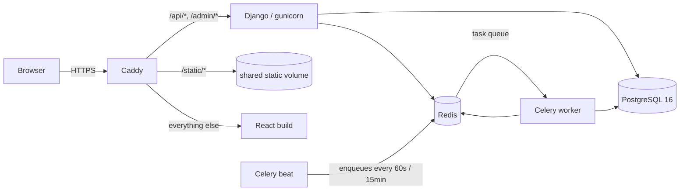
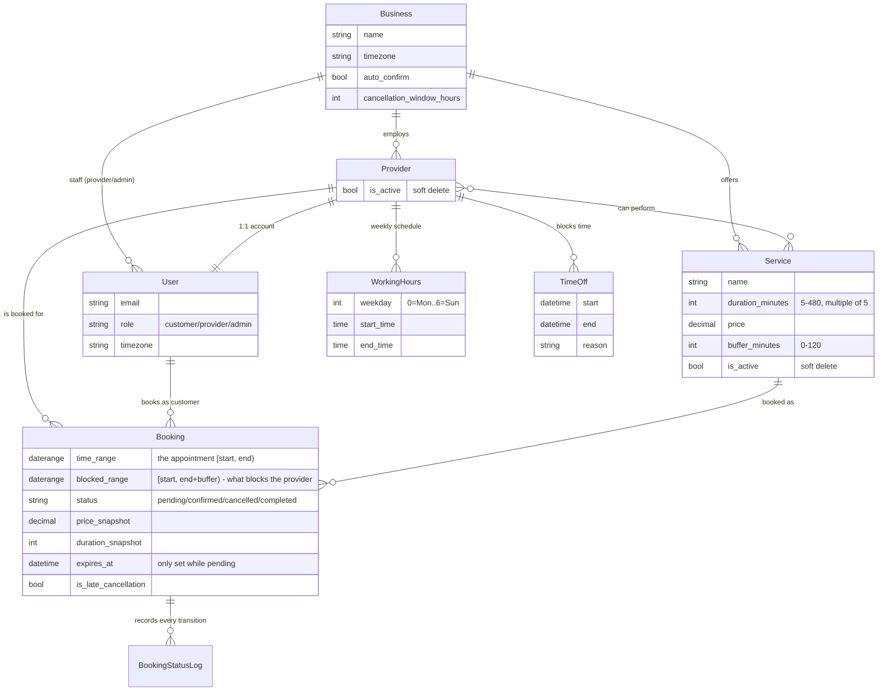
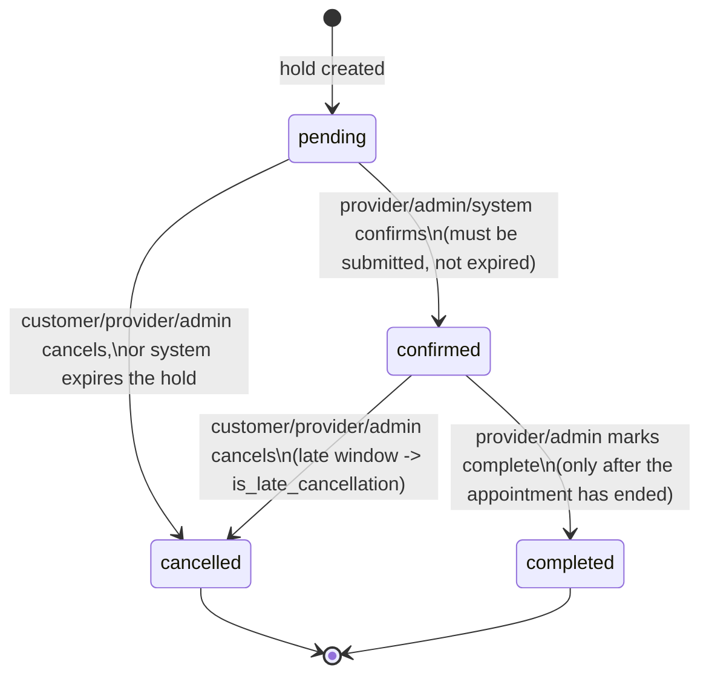

# Architecture

## Containers and request flow

Matches the actual production topology in `deploy/docker-compose.prod.yml` (Caddy fronts
everything on one origin — the SPA and the API — so the frontend has never needed CORS).



Beat schedules two recurring tasks: `expire_stale_holds` (every 60s — cancels pending bookings
past their hold TTL) and `scan_and_send_reminders_task` (every 15min — 24h-ahead email
reminders). Both are a safety net, not the primary mechanism — see "Hold + lazy expiry" below.

## Data model



`price_snapshot`/`duration_snapshot` are copied onto the booking at creation time — a later
price change on the `Service` never rewrites history for an existing booking.

## Why exclusion constraints, not just an application-level check

The one invariant this whole project is graded on is "a slot can never be double-booked, even
under concurrent requests." An application-level check (`if not Booking.objects.filter(...).
exists(): create(...)`) has a race window between the check and the insert — two concurrent
requests can both pass the check before either commits. The fix is a database-level guarantee
that makes the conflicting state literally unrepresentable:

```python
ExclusionConstraint(
    name="booking_no_provider_overlap",
    expressions=[("provider", "="), ("blocked_range", "&&")],
    condition=Q(status__in=["pending", "confirmed"]),
)
```

This is Postgres's `EXCLUDE USING gist (provider WITH =, blocked_range WITH &&)` — "no two rows
with an equal `provider` may have an overlapping `blocked_range`," enforced at insert/update
time regardless of how many transactions race for it. It requires the `btree_gist` extension
(applied as the first migration operation, `BtreeGistExtension()`) to index a plain equality
column (`provider`) alongside a range column in the same GiST index. A second, symmetric
constraint does the same for `customer`/`time_range` (a customer can't be in two places at
once). Application code still catches the resulting `IntegrityError` and turns it into a clean
`409 slot_unavailable` with alternatives — the constraint is the actual guarantee, the
try/except is just for a good error message.

`blocked_range` (not `time_range`) is what the provider-overlap constraint checks, because the
service's `buffer_minutes` (cleanup/setup time) also needs to block the provider even though
it's not part of what the customer is paying for or sees as "the appointment."

## Availability algorithm

`apps/scheduling/services/availability.py::get_available_slots` answers "what's free for this
service, across N days, across M providers" in a **fixed small number of queries regardless of
the date range or provider count**: one query for working hours, one for time off, one for
active bookings across the whole window — then everything else (subtracting time off and
existing bookings from working hours, walking a 15-minute grid, converting local wall-clock
times to UTC) happens in Python, in memory. Adding more days or more providers to a query never
adds more database round trips, only more rows returned by the same three queries — proven by
a `CaptureQueriesContext`-based test asserting identical query counts for a 1-day vs. 14-day and
a 2-provider vs. 3-provider request.

Local-to-UTC conversion (`_local_to_utc`) is DST-aware: it round-trips a candidate UTC instant
back through the business's timezone and compares against the original wall-clock time,
detecting the two DST edge cases zoneinfo doesn't raise for on its own — a spring-forward gap
(the wall-clock time never existed that day; the slot is dropped) and a fall-back ambiguity
(handled by always preferring the earlier occurrence, `fold=0`).

## Booking lifecycle

Every status change goes through exactly one function, `transition_booking` (in
`apps/bookings/services/booking.py`) — never a direct `.save()` on `booking.status` anywhere
else in the codebase. It looks up the edge in a `STATE_MACHINE` dict keyed by
`(from_status, to_status)`, checks the actor is allowed to perform it, runs any extra rule (e.g.
"must be submitted and not expired," "must be past the end time"), writes a `BookingStatusLog`
row, and schedules the notification email via `transaction.on_commit` — all inside one
`select_for_update()`-locked transaction, which is what makes the confirm/cancel concurrency
race safe (see `apps/bookings/tests/test_concurrency.py`).



An invalid edge (e.g. `completed → confirmed`) returns `409 invalid_transition`; a
disallowed actor returns `403`. Both are checked inside the same locked transaction as the
actual state read, so there's no window for the checked state to go stale before the write.

## Hold + lazy expiry

A hold (`pending`, `expires_at = now + 10min`) reserves a slot the instant it's created, before
the customer has even submitted it — this is what makes the two-tab race test in
`docs/AI_USAGE.md` work the way it does: the loser sees the slot vanish immediately, not after
a round trip. Expiry is enforced two ways simultaneously, deliberately redundant:

1. **Celery beat**, every 60 seconds, sweeps every stale pending hold and cancels it via the
   same `transition_booking` function everything else uses.
2. **Lazily, inline**, inside `create_hold` itself: before inserting a new hold, any
   already-expired pending holds overlapping the requested range are cancelled first, in the
   same transaction. This means a customer is never blocked by a stale hold just because beat
   happens to be down or hasn't run yet in the last minute — the system self-heals on the very
   next request that needs that slot, without waiting on the scheduler at all.

## Idempotency

`POST /bookings/` accepts an `Idempotency-Key` header. The same key + the same customer, sent
twice (a real scenario: a mobile client retries a timed-out request), returns the *existing*
booking with `200` instead of creating a second one with `201` — enforced by a
`UniqueConstraint(customer, idempotency_key)` (partial: only where the key is non-null), with
the same "check for an existing match on any conflict, not just a specific one" logic in
`create_hold` that a Section 5 concurrency test caught missing on the first pass (two clients
racing the same key, where the DB reports the *other* constraint that fired first).

## Timezone strategy

Every stored datetime is UTC (`Booking.time_range`, `TimeOff.start/end`, etc.). Working hours
are the one exception: they're stored as bare `time` values (`WorkingHours.start_time`), because
"9 AM to 6 PM" is a statement about the business's local clock, not a UTC instant — converting
them to UTC once and storing that would silently break the moment the business's region ever
observed DST. Conversion to/from UTC happens only at the edges (the availability engine, and API
serialization), using `zoneinfo` with the `Business.timezone` (an IANA string, validated against
`zoneinfo.available_timezones()`). The frontend never converts timezones itself — every API
response is already UTC ISO 8601 (`Z` suffix), and `date-fns-tz` converts to the signed-in
user's own `timezone` field purely for display.

## Trade-offs and what I'd do next with more time

This is a test-task-scoped build; several real-world features were deliberately cut rather than
half-built:

- **Recurring bookings** ("every Tuesday at 3pm") — the current model has no concept of a
  booking series; each one is independent. Would need a `RecurrenceRule` model and a
  materialization strategy (generate N occurrences ahead vs. compute on the fly).
- **Payments** — `price_snapshot` exists and is copied at booking time, but nothing actually
  charges a card. Would add a `Payment` model and a webhook-driven status (a payment provider's
  webhook is itself a second source of truth that needs the same "don't trust the client"
  treatment the booking state machine already gets).
- **Multi-business tenancy at the auth boundary** — the data model already supports many
  `Business` rows (this is how the test suite proves cross-tenant isolation), but there's no
  business-picker UI or subdomain routing; today's frontend implicitly assumes one business per
  deployment.
- **WebSocket live slot updates** — availability is pull-based (the frontend refetches after a
  409). A busy salon's calendar going stale between refetches is the real cost; Django Channels
  + a Redis pub/sub on booking state changes would fix it, at the cost of a stateful connection
  the current stack doesn't need anywhere else.
- **Per-user rate limiting** — throttling today is scoped to specific endpoints (`register`,
  `login`), not a general per-user API budget. Worth adding once there's a real abuse signal to
  design against, rather than guessing at a number now.
